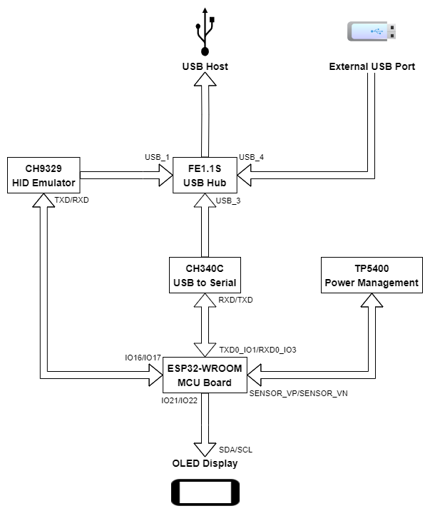

# Documentation about the hardware

## System Architecture Diagram

## ESP32 MCU Port Mapping
|Port Name|Connected to|
|--|--|
|KeyMatrix_ROW
|IO27|KeyMatrix row 1|
|IO32|KeyMatrix row 2|
|IO33|KeyMatrix row 3|
|IO25|KeyMatrix row 4|
|IO26|KeyMatrix row 5|
|KeyMatrix_COL
|IO5|KeyMatrix column 1|
|IO18|KeyMatrix column 2|
|IO19|KeyMatrix column 3|
|IO23|KeyMatrix column 4|
|IO4|KeyMatrix column 5|
|OLED_I2C
|IO21|OLED display SDA|
|IO22|OLED display SCL|
|CH9329_HID
|IO16|CH9329 chip TXD|
|IO17|CH9329 chip RXD|
|TP5400_BATT
|SENSOR_VP / IO36|Battery voltage ADC|
|IO39 / SENSOR_VN|Charging indicator|
|CH340_SER
|TXD0 / IO1|CH340 chip RXD|
|RXD0 / IO3|CH340 chip TXD|